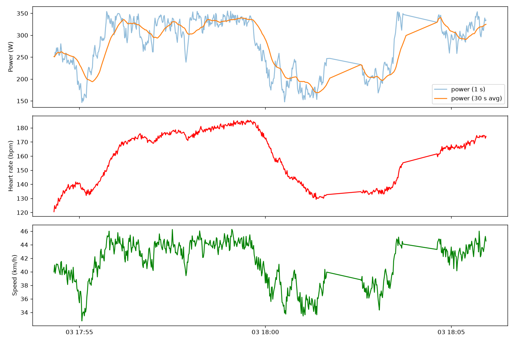
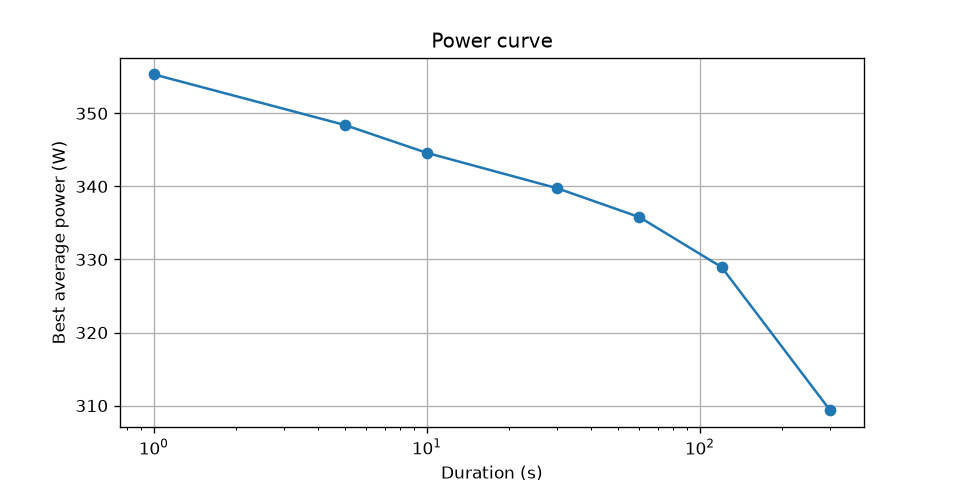
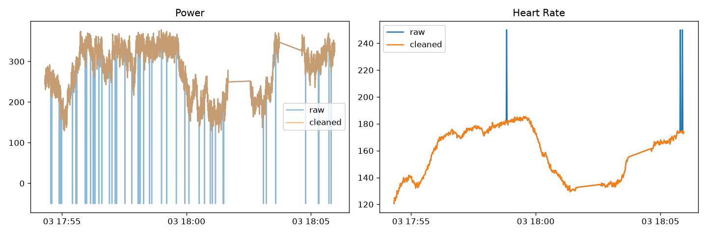

# Sensor Telemetry

The project generates, transmits, records, and analyzes sensor data that simulates a bike ride (power, heart rate, cadence, speed, GPS).
Data is sent in real time over MQTT and analyzed with pandas.

## Architecture

sensors (threads) --> queue --> publisher --> MQTT broker --> subscriber --> queue --> CSV writer --> pandas analysis

## How to run

    python -m venv venv
    source venv/bin/activate
    pip install -r requirements.txt

- Terminal 1: "python subscriber.py"
- Terminal 2: "python publisher.py"

Run for a few minutes, stop both with Ctrl + C, then open "analysis.ipynb".

## Design decisions

- **Threads + queue:** Each sensor runs in its own thread at its own rate. A queue passes data to one publisher thread, so the network never blocks the sensors.
- **No heavy work in the MQTT callback:** If the callback is slow, new messages have to wait. So it only puts messages in a queue, and a separate thread writes them to CSV.
- **Different sampling rates:** Real sensors measure at different rates. Power changes fast, while heart rate and GPS change slowly. Because of this, I had to sync data before analysis.
- **One CSV per sensor:** Sensors send data at different speeds, so putting everything in one file would leave lots of missing values. Keeping them separate was simpler, and I combine them later in analysis.
- **Data cleaning:** Real sensors make mistakes, so I added some fake errors and removed them in the analysis. 

## Results

Heart rate follows power with delay, while speed changes right away.

Shorter efforts have higher power.

After cleaning, the wrong values are removed.

